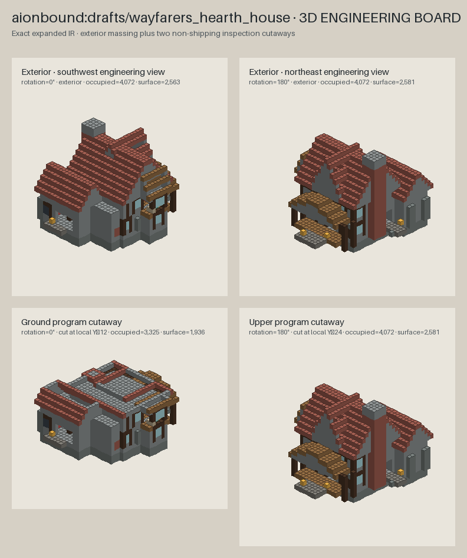

# AIONSTRUCT AI Builder

A Codex plugin and standalone offline toolkit for AI-assisted Minecraft Bedrock structure development—without Minecraft Editor and without driving a player to place blocks.

**[Explore the castle and house showcase →](https://exo-robotics.github.io/aionstruct-ai-builder/)**



## What it does

- Authors bounded semantic `Plan v1` components with stable IDs and explicit dependency order, then lowers them to the unchanged Blueprint v1 language.
- Converts strict, finite JSON blueprints into deterministic final voxel IR.
- Emits structured Plan diagnostics, hash-bound component source maps, material/layer inspections, canonical fingerprints, and structural diffs.
- Audits whole structure portfolios for palette-swapped, translated, rotated, or reflected architectural clones while preserving explicit-air versus void distinctions.
- Enforces optional purpose contracts answering why a player approaches, enters, and leaves changed, plus at least two architectural distinctness axes.
- Checks traversal, full-depth apertures, stair clearance, fixture support, lighting coverage, material balance, and stale previews.
- Renders top-down, floor, elevation, isometric, cutaway, and static-light engineering views.
- Compiles little-endian `.mcstructure` bytes using Bedrock's Z-fastest index order.
- Reopens and compares every compiled voxel with an independent NBT reader.
- Preserves explicit air separately from structure void.
- Keeps static, BDS, client, gameplay, world-generation, and console evidence separate.

The repository includes the multi-level **Wayfarer's Hearth House** as an editable reference project.

## IronStruct for Unreal Engine

IronStruct is maintained independently at [EXO-Robotics/ironstruct-ue-builder](https://github.com/EXO-Robotics/ironstruct-ue-builder). Its Unreal Engine plugin, skill, MCP guidance, lighting heatmaps, collision workflow, and Grok art-direction guide are no longer packaged with AIONSTRUCT.

## Install in Codex

```bash
codex plugin marketplace add EXO-Robotics/aionstruct-ai-builder --ref main
codex plugin add aionstruct-ai-builder@aionstruct
```

Install IronStruct from its own marketplace:

```bash
codex plugin marketplace add EXO-Robotics/ironstruct-ue-builder --ref main
codex plugin add ironstruct-ue-builder@ironstruct
```

Start a new Codex task, then ask:

```text
Use $build-aionstruct-structures to design and validate an original Bedrock roadside inn.
```

## Use as a standalone toolkit

Create a clean project:

```bash
python3 plugins/aionstruct-ai-builder/scripts/bootstrap_project.py ./my-structure-project
cd my-structure-project
python3 -m pip install -r requirements.txt
```

Build the included example:

```bash
python3 tools/aionstruct.py build \
  aionstruct/examples/wayfarers_hearth_house.aionstruct.json \
  --contract aionstruct/examples/wayfarers_hearth_house.quality.json
```

The command writes deterministic IR, `.mcstructure` bytes, a full-volume decode receipt, engineering previews, and a static quality report.

Try semantic Plan v1:

```bash
python3 tools/aionstruct.py plan validate \
  aionstruct/examples/semantic_roadside_house.aionplan.json
python3 tools/aionstruct.py plan lower \
  aionstruct/examples/semantic_roadside_house.aionplan.json
python3 tools/aionstruct.py validate \
  build/semantic_roadside_house.blueprint.json
```

Lowering creates only ordinary Blueprint v1 operations and a separate hash-bound source map. Existing Blueprint sources and their compiler bytes remain compatible.

## Commands

```bash
python3 tools/aionstruct.py doctor
python3 tools/aionstruct.py plan validate <plan>
python3 tools/aionstruct.py plan lower <plan>
python3 tools/aionstruct.py validate <blueprint>
python3 tools/aionstruct.py expand <blueprint>
python3 tools/aionstruct.py preview <blueprint> --contract <quality-contract>
python3 tools/aionstruct.py quality <blueprint> --contract <quality-contract>
python3 tools/aionstruct.py compile <blueprint>
python3 tools/aionstruct.py build <blueprint> --contract <quality-contract>
python3 tools/aionstruct.py materials <blueprint>
python3 tools/aionstruct.py layers <blueprint>
python3 tools/aionstruct.py fingerprint <blueprint>
python3 tools/aionstruct.py topology <blueprint>
python3 tools/aionstruct.py portfolio <blueprints...> --contract <portfolio-contract>
python3 tools/aionstruct.py diff <left-blueprint> <right-blueprint>
```

## Design influences

Plan v1 applies the semantic-plan and dependency-graph pattern documented by [CraftDAG](https://github.com/i365dev/CraftDAG), while retaining AIONSTRUCT's own Bedrock compiler and proof authority. Its non-mutating fingerprint/diff workflow is informed by [Nucleation](https://github.com/Schem-at/Nucleation), and future benchmark work will use the spatial-understanding, reasoning, creativity, and commonsense categories described by [MineAnyBuild](https://mineanybuild.github.io/). These are design references, not runtime dependencies; CraftDAG explicitly does not provide Bedrock support.

## Evidence boundary

A successful Plan lowering proves semantic validation, dependency ordering, Blueprint validation, and hash-bound source mapping. A passing portfolio audit proves only static topology distinctness and completeness of authored purpose answers; it does not prove visual quality or memorability. A successful offline build additionally proves deterministic expansion, static spatial analysis, optimistic light coverage, deterministic encoding, and independent decode equality. None of these proves BDS placement, runtime light, mob spawning, client appearance, terrain fit, multiplayer behavior, console compatibility, or release readiness.

Qualify exact compiled bytes separately in a disposable, digest-pinned Bedrock Dedicated Server before making runtime claims.

## Development

```bash
python3 plugins/aionstruct-ai-builder/scripts/self_test.py
python3 plugins/aionstruct-ai-builder/scripts/package_plugin.py
```

See [CONTRIBUTING.md](CONTRIBUTING.md) for validation expectations.

## License

MIT

Minecraft is a trademark of Microsoft. This independent project is not affiliated with or endorsed by Microsoft or Mojang.
